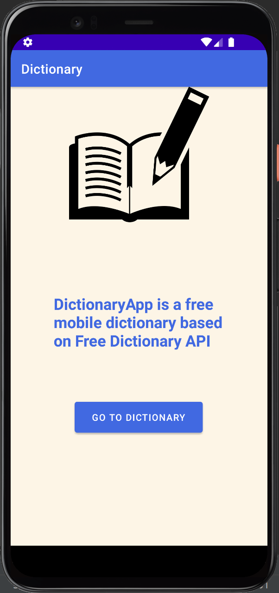

# DictionaryApp
Final project for 'Data processing in cloud computing' course. Mobile app for android based on Free Dictionary API
Author: Kacper Jach

API Source: https://dictionaryapi.dev/

# Technologies
* Java
* Android SDK 27

# IDE
Android Studio Arctic Fox 2020.3.1 Patch 3

# Starting screen

# Searching word in dictionary

# Result from dictionary
Contains such piecies of information as: word, phonetics, audio player nad definiton of the word.

